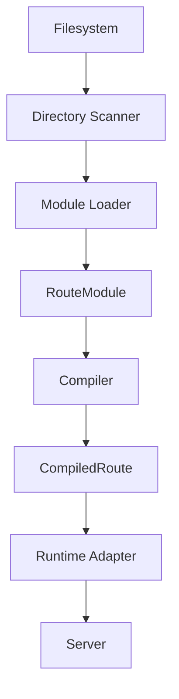

**v0.14.0 ships a compiler that turns your file tree into an immutable, fully-compiled application, a shared request context, validation built on Zod v4 and Standard Schema, and native dynamic routing on Bun. The core is the single place that understands your routes. Backward compatibility is not a goal. The better design wins.**

<!-- truncate -->

## Why a compiler-driven core

BurgerAPI has always been file-based. The compiler is the single place that understands your application. The same compiler runs in development and in production. They differ only in *when* and *how often* it runs. At startup (or at build for production), the compiler walks your route directories, assembles each into a `RouteModule`, and emits `CompiledRoute`s. At request time, the runtime only executes what was already compiled.

Nothing that can be computed once is computed per request.

## The Route Module pipeline



- **Directory Scanner** walks the tree and records which convention files exist. It performs no `import()` and rejects `middleware.ts` as a route-file convention (middleware is registered as functions, not discovered as route files).
- **Module Loader** imports the files, resolves group inheritance (a route inherits `schema.ts`, `openapi.ts`, `hooks.ts`, and `use.ts` from ancestor groups, nearest-last), and assembles one `RouteModule` per route directory. It fails fast on duplicate route paths.
- **RouteModule** is the internal contract between the scanner and the compiler. `CompiledRoute` is the contract between the compiler and the runtime. Keeping them separate means the runtime never re-discovers, re-merges, or re-validates anything.
- **Runtime Adapter** isolates the one runtime-specific surface. `BunAdapter` wraps `Bun.serve` and Bun's native `routes` map. Static routes, and dynamic `:param` and `*` wildcard routes, dispatch directly through Bun's native map. The framework body stays Web-Standard and self-extracts parameters from `request.url` on runtimes without native routing.

## The request context

Every request gets a shared-prototype request context (`BurgerContext`, typed as `BurgerRequest` at the handler). It exposes `req.query`, `req.route`, `req.params`, `req.set`, and `req.validated`. Query parsing is lazy: the query string is only parsed when you read `req.query`. The same object template is reused across requests to keep memory use and per-request work low.

## Validation 2.0

Validation runs on Zod v4 and any Standard Schema. A route exports a `schema` with `params`, `query`, and `body` targets. Matching values are available through `req.validated`. A failing body validation returns a `400` with the field errors. Validation is compiled into the runtime, so the rules are checked once at compile time and applied with no extra discovery at request time.

## What this means for you

A route directory is a module. Sibling files are discovered automatically:

```
api/
  users/
    route.ts     # HTTP handlers only
    schema.ts    # validation only
    openapi.ts   # documentation only
    hooks.ts     # reserved: lifecycle hooks (not yet executed)
    use.ts       # reserved: capabilities (not yet executed)
    webhook.ts   # reserved: webhook definitions (not yet executed)
```

Group folders carry shared files that descendants inherit. The compiler merges them deterministically. If two route directories resolve to the same URL, or a `middleware.ts` route file is found, the compiler errors loudly at startup. That is cheaper than a surprise at request time.

## Request lifecycle today

The request lifecycle runs through the **middleware pipeline**: `globalMiddleware` (set on `ServerOptions`) and a route's `middleware` array. A middleware can stop the request early by returning a `Response`, transform the response by returning a function, or continue by returning `undefined`. Validation, OpenAPI generation, and `405`/`Allow` handling are all part of the compiled runtime.

The `hooks.ts`, `use.ts`, and `webhook.ts` convention files are discovered and carried through the compiler, but they are not yet executed at runtime. They are reserved for later releases.

## Native dynamic routing

On Bun, a dynamic route such as `api/users/:id/route.ts` is registered directly in Bun's native `routes` map. Parameter and wildcard segments dispatch in O(1) with no framework trie traversal. On other WinterCG runtimes, the framework router emits Web-Standard handlers that read the matched parameters from `request.url`. The same handler contract works everywhere.

## What works today

Routing (static and dynamic dispatch), native `:param` and `*` wildcard routing on Bun, `405` handling with an `Allow` header, loose trailing-slash matching, automatic `HEAD`, compiled Zod v4 / Standard Schema validation, and automatic OpenAPI 3.0 plus Swagger UI all work today.

This release is the foundation the rest of the framework builds on.
