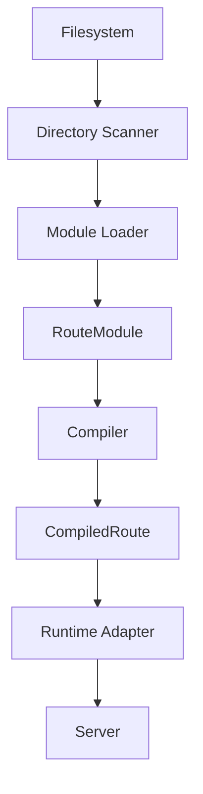

# Compiler Pipeline

BurgerAPI compiles your file tree into an immutable, fully-compiled application. The compiler is the single place that understands the whole app. This page describes how a directory of route files becomes a running server.

## Overview

The compiler processes every route directory through a short pipeline. Development and production run the same compiler; they differ only in how often it runs.

## Directory Scanner

The scanner walks the API directory and records the convention files in each route directory. It does **not** import any module. It only builds an inventory. This keeps the walk fast and free of side effects.

Recognized files:

- `route.ts`: HTTP method handlers
- `schema.ts`: validation
- `openapi.ts`: documentation
- `hooks.ts`: reserved; lifecycle hooks (carried through, not yet executed)
- `use.ts`: reserved; capabilities (carried through, not yet executed)
- `webhook.ts`: reserved; webhook definitions (carried through, not yet executed)

A `middleware.ts` route file is rejected. Middleware is registered as functions
(`globalMiddleware` on `ServerOptions` and a route's `middleware` array), not
discovered as a route-file convention.

## Module Loader

The loader imports the convention files discovered by the scanner and assembles one `RouteModule` per route directory.

- It merges group inheritance: a route inherits `hooks.ts`, `use.ts`, and `schema.ts` from ancestor group folders, nearest-last and deterministic.
- A route's own file overrides the inherited one for the same concern.
- It fails fast on duplicate route paths. Two directories that resolve to the same URL are a startup error.

## RouteModule

A `RouteModule` is the compiler's canonical view of one route directory. It holds the handlers, schema, hooks, capabilities, OpenAPI metadata, and webhook definition for that route, plus the group chain used for inheritance.

`RouteModule` is the contract between the scanner and the compiler. `CompiledRoute` is the contract between the compiler and the runtime. Because they are separate, the runtime never re-discovers, re-merges, or re-validates anything. It only executes.

## Compiler

The compiler turns each `RouteModule` into an immutable `CompiledRoute`. It classifies routes as static or dynamic, builds the dispatch tables, and bakes in method handling, `405` responses with an `Allow` header, loose trailing-slash matching, and automatic `HEAD`. The result is frozen for the life of the server.

In v0.14.0 the request lifecycle runs through the **middleware pipeline**: `globalMiddleware` (from `ServerOptions`) followed by a route's `middleware` array. A middleware can stop the request early by returning a `Response`, transform the response by returning a function, or continue by returning `undefined`. The `hooks.ts`, `use.ts`, and `webhook.ts` data is carried on the `RouteModule` but is not executed yet; it is reserved for later releases.

## Runtime Adapter

The framework body speaks only Web Standard `Request` and `Response`. The one runtime-specific surface is the adapter, which translates how a request enters and a response leaves. `BunAdapter` wraps `Bun.serve` and Bun's native `routes` map: static routes dispatch directly, dynamic and wildcard routes through an internal trie. Other runtimes can be reached through additional adapters without changing the compiler or router.

## Related

- [Architecture Overview](/docs/architecture/overview)
- [Routing Engine](/docs/architecture/routing-engine)
- [File-Based Routing](/docs/routing/file-based-routing)
