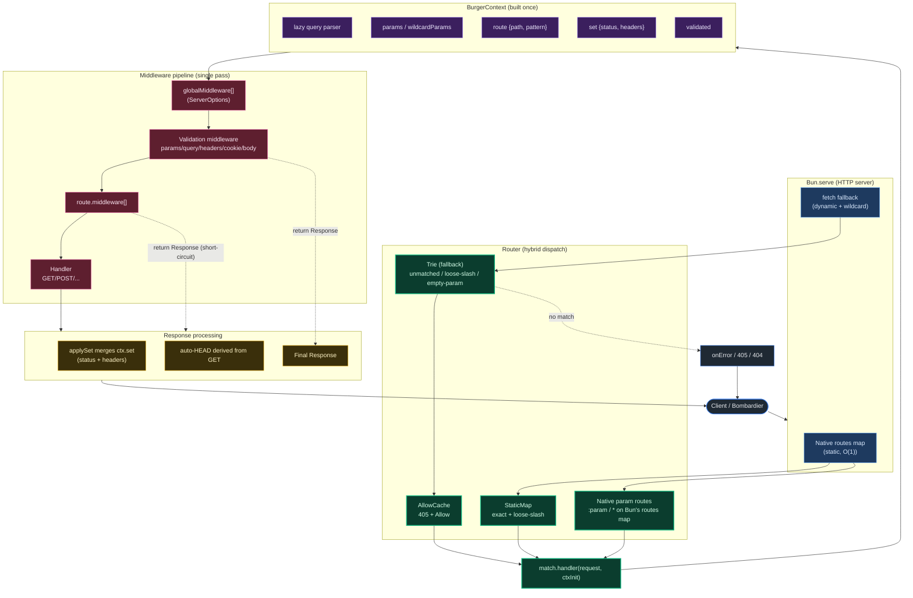

# Inside BurgerAPI

This page shows how a request travels through BurgerAPI at runtime. It complements the [Compiler Pipeline](./compiler-pipeline) page, which covers build time. Here we follow a single request from the socket to the response.

## What each stage does

1. **Bun.serve** accepts the connection. Static paths hit Bun's native `routes` map directly; everything else reaches the `fetch` fallback.
2. **Router** owns the compiled dispatch state: a `StaticMap` (exact + loose-trailing-slash), a `Trie` (`:param` beats `*` by priority), and an `AllowCache` for `405` responses.
3. **Compiled handler** (`match.handler`) seeds a `ContextInit` with `route`, `params`, and `wildcardParams`, then builds the single `BurgerContext`.
4. **BurgerContext** is allocated once per request. `query` is parsed lazily, `set` collects response mutations, and `validated` holds validation output.
5. **Middleware pipeline** runs in one pass: `globalMiddleware` → validation middleware → route `middleware` → your handler. Any stage may return a `Response` to stop early, or a function to transform the final response (applied in reverse order).
6. **Response processing** merges `ctx.set` into the response exactly once and derives `HEAD` from `GET`. `405`/`404`/`onError` exit the same way.

Because static and dynamic routes run the same compiled handler, method dispatch, `405`/`Allow`, auto-`HEAD`, and middleware behavior are identical for every route.

## Related

- [Compiler Pipeline](/docs/architecture/compiler-pipeline)
- [Request Lifecycle](/docs/architecture/request-lifecycle)
- [Routing Engine](/docs/architecture/routing-engine)
- [BurgerContext](/docs/architecture/burger-context)
