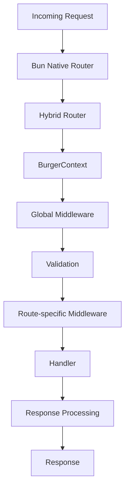

# Request Lifecycle

A request moves through BurgerAPI in a single, predictable pipeline. The diagram below shows the stages from the moment a connection arrives to the moment a response is returned.

## Stage by stage

1. **Bun Native Router** — Bun accepts the connection and, for static paths, dispatches directly to the matching route.
2. **Hybrid Router** — dynamic and wildcard paths are resolved by the trie, choosing the most specific match (static → dynamic → wildcard).
3. **BurgerContext** — a single request context object is created for the request, carrying route-specific data such as `params` and `route`.
4. **Global Middleware** — middleware registered in `globalMiddleware` runs first, in order.
5. **Validation** — if the route declares Zod schemas, `params`, `query`, and `body` are validated and the result is attached to `req.validated`. Invalid requests stop here with a structured error.
6. **Route-specific Middleware** — the route's own `middleware` array runs, in order.
7. **Handler** — your exported `GET`/`POST`/... function runs and returns a `Response`.
8. **Response Processing** — any `req.set` mutations (status and headers) are merged into the response exactly once, and auto-`HEAD` responses are derived from `GET`.
9. **Response** — the final `Response` is sent back to the client.

Because the pipeline is fixed, behavior is consistent across every route: global middleware and validation always run before the handler, route-specific middleware always runs after validation, and response mutations are always applied at the same point.

## Related

- [Architecture Overview](/docs/architecture/overview)
- [Routing Engine](/docs/architecture/routing-engine)
- [BurgerContext](/docs/architecture/burger-context)
- [Request Context](/docs/core/request-handling)
